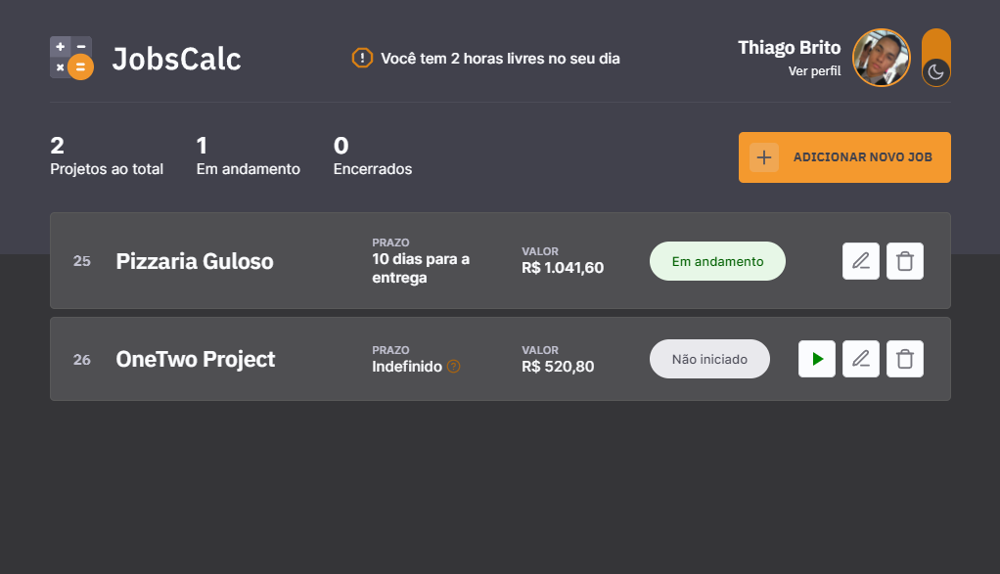

<div align="center">
  <div>
    <h1>JobsCalc</h1>
    
    <h3>
      👨‍💻 Uma aplicação JavaScript Vanilla para visualização, armazenamento e gerenciamento de projetos freelance
    </h3>
  </div>

  <p>
    <a href="#-status">Status</a> •
    <a href="#-features">Features</a> • 
    <a href="#%EF%B8%8F-pré-requisitos">Pré-requisitos</a> • 
    <a href="#-tecnologias-utilizadas">Tecnologias utilizadas</a> • 
    <a href="#-autor">Autor</a> •
    <a href="#-readme-versions">README versions</a>
  </p>

  <div>
    
    
    
  </div>
</div>

<hr>

### 🏁 Status

<h3 align="center">
  🎉 JobsCalc ✔️ Finalizado 🎉
</h3>

<hr>

### 🏆 Features

- [x] Implementar design responsivo;
- [x] Habilitar/desabilitar tema escuro;
- [x] Informar, com base nos dados de perfil do usuário, a quantidade de horas livres que o mesmo tem em seu dia;
- [x] Realizar e exibir a contagem de quantos projetos o usuário possui ao todo, quantos estão em andamento e quantos já foram finalizados;
- [x] Editar dados de perfil;
- [x] Adicionar e iniciar automaticamente, ou não, novos projetos freelance;
- [x] Iniciar projetos, opção válida apenas para projetos que não foram iniciados no momento de sua criação;
- [x] Calcular e exibir, de acordo com os dados do usuário, o valor dos projetos iniciados;
- [x] Calcular e exibir, de forma detalhada, o tempo restante até a data de entrega dos projetos iniciados;
- [x] Exibir, de acordo com o tempo restante, o marcador de cada projeto, isto é, se "não iniciado", "em andamento" ou "finalizado";
- [x] Editar projetos; e
- [x] Excluir projetos.

<hr>

### ❗️ Pré-requisitos

Fala, Dev, beleza? Antes de iniciar seus testes e/ou contribuições na aplicação, é necessário ter duas coisas instaladas, a primeira é o nosso maravilhoso [GIT](https://git-scm.com), e a segunda, o [Node.js](https://nodejs.org/en/), além, é claro, de um bom editor de texto.

Bom, com tudo instalado e pronto, podemos ir para o passo a passo de como rodar a aplicação.

### 🕹️ Rodando a aplicação

```bash
# Primeiramente, clone este repositório com o GIT.
$ git clone <https://github.com/trybrito/jobscalc>

# Acesse a pasta do projeto pelo terminal de comando.
$ cd .../jobscalc

# Instale as dependências presentes no package.json.
$ yarn / npm install

# Inicialize o banco de dados.
$ yarn init-db

# Execute o servidor da aplicação.
$ yarn dev

# E finalmente, acesse <http://localhost:3000> para ver a aplicação rodando no servidor local.
```

<hr>

### 🔮 Tecnologias utilizadas

#### Geral

- [JavaScript](https://devdocs.io/javaScript/)

#### 💻 Frontend

- [EJS](https://ejs.co/)
- [CSS](https://devdocs.io/css/)

#### ⚙️ Backend

- [Node.js](https://nodejs.org/en/)
- [Nodemon](https://www.npmjs.com/package/nodemon)
- [Express.js](https://expressjs.com/pt-br/)
- [SQLite](https://www.sqlite.org/index.html)

<hr>

### 👨🏽‍🎓 Autor

<div align="center">
  

  <br />

  <div>
    <h3>
      🤝 Thiago Raniery Brito
    </h3>
    <p>
      E aí, Dev, gostou da aplicação? Bom, se quiser, fique à vontade para contribuir com o projeto e/ou entrar em contato comigo por meio das plataformas abaixo, até mais!
    </p>
  </div>
  
  <div>
    <a href="https://www.linkedin.com/in/trybrito">
      </a>
    <a href="mailto:thiagobritotrs@gmail.com">
      </a>
  </div>
</div>

<hr>

### 📚 README versions

<div>
  <a href="https://github.com/trybrito/jobscalc/blob/main/README.md">Portuguese (pt-br)</a>
  |
  <a href="https://github.com/trybrito/jobscalc/blob/main/README-en.md">English (en-us)</a>
</div>
